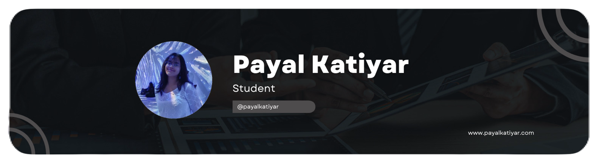

# I'm [Payal](https://www.linkedin.com/in/payalkatiyar)

I'm Payal Katiyar, a BTech CSE Core student at SRMIST, deeply passionate about coding and leveraging new technologies. Here, you'll find a collection of my projects, showcasing my dedication to innovation and problem-solving. Let's connect and collaborate to push the boundaries of what's possible in the world of technology.

- 📝 &nbsp;You can find my portfolio [here](https://www.payalkatiyar.com).
- 👨‍🎓 &nbsp;Pursuing my [B.Tech in CSE](https://www.srmist.edu.in).
- 📫 &nbsp;You can contact me [here](mailto:contact@payalkatiyar.com).

 

🔥 &nbsp;Github Streak

 

🛠️ &nbsp;Tools & Frameworks

 

